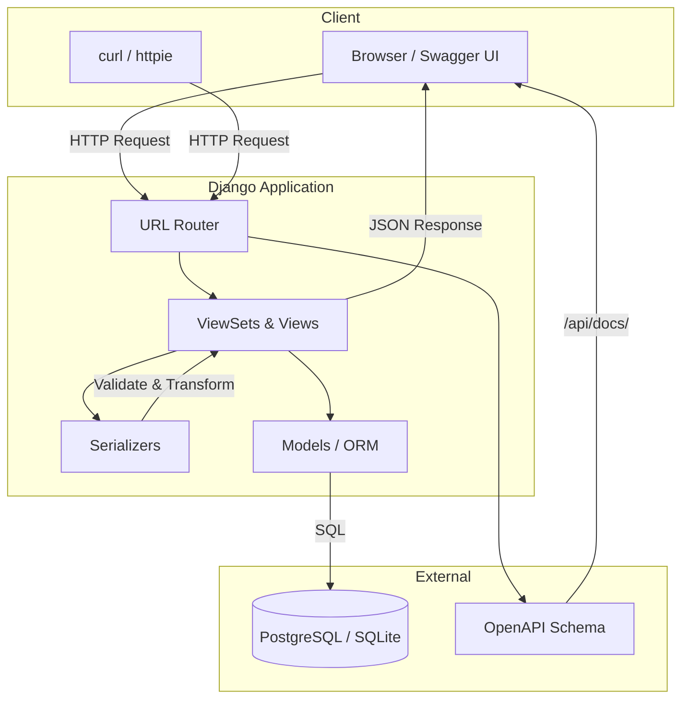
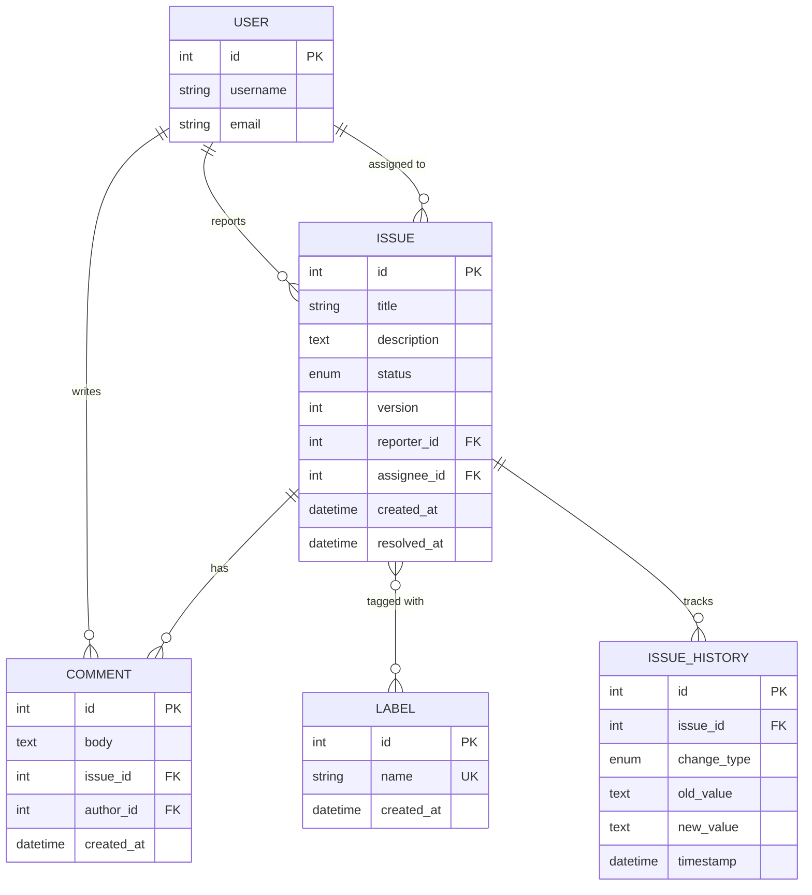
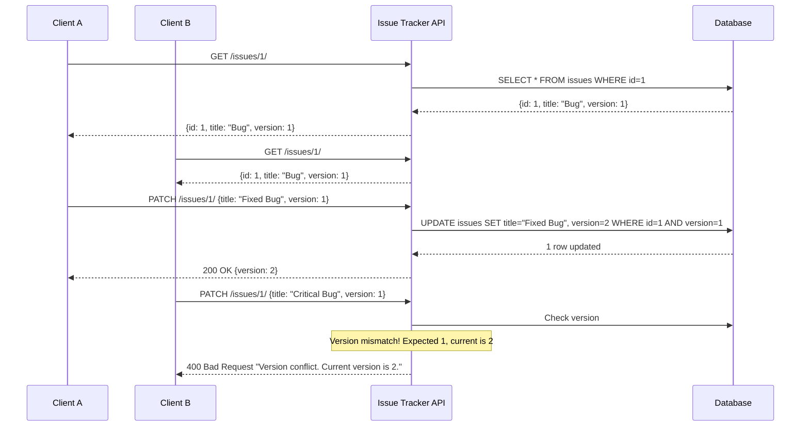

# Issue Tracker API 🎫

Hey there! This is a REST API for managing issues, comments, and labels - think of it like a simplified Jira or GitHub Issues. Built with Django and Django REST Framework.

## What's Inside?

This project covers most of what you'd need in a real issue tracker:
- **Issues** with full CRUD, plus optimistic locking so two people don't overwrite each other's changes
- **Comments** on issues (can't be empty, obviously)
- **Labels** that you can attach to issues
- **Bulk updates** - change status of multiple issues at once, all-or-nothing
- **CSV import** - upload a spreadsheet of issues
- **Reports** - who's got the most issues assigned, how fast are we resolving stuff
- **Timeline** - see the history of changes on an issue (bonus feature!)

## Architecture Overview

Here's how the pieces fit together:



## Database Design

Four main tables with a junction table for the many-to-many relationship:



**Why the `version` field?** It's for optimistic concurrency control. When you update an issue, you send the version you have. If someone else updated it first, the versions won't match and you'll get an error. No accidental overwrites.

## Getting Started

### Quick Start (SQLite, no Docker needed)

```bash
# Set up the project
make setup
source venv/bin/activate

# Create tables and add some test data
make migrate
make seed

# Fire it up
make run
```

Now open http://localhost:8000 - you'll see the Swagger UI where you can try out every endpoint.

### With Docker (PostgreSQL)

```bash
make docker-up
```

Same deal, just go to http://localhost:8000.

## API Endpoints

| Endpoint | What it does |
|----------|--------------|
| `GET /api/issues/` | List all issues (has filtering & pagination) |
| `POST /api/issues/` | Create a new issue |
| `GET /api/issues/{id}/` | Get one issue with its comments and labels |
| `PATCH /api/issues/{id}/` | Update an issue (include `version`!) |
| `POST /api/issues/{id}/comments/` | Add a comment |
| `PUT /api/issues/{id}/labels/` | Replace all labels on an issue |
| `GET /api/issues/{id}/timeline/` | See change history |
| `POST /api/issues/bulk-status/` | Update multiple issues at once |
| `POST /api/issues/import/` | Upload CSV to create issues |
| `GET /api/reports/top-assignees/` | Who has the most issues? |
| `GET /api/reports/latency/` | How fast are issues being resolved? |

## How Optimistic Locking Works

Here's the flow:



## CSV Import Format

Your CSV should look like this:

```csv
title,description,status,reporter_username,assignee_username
"Login page broken","Users can't log in","open","john","jane"
"Add dark mode","Would be nice to have","in_progress","jane","bob"
```

Upload it and you'll get back a report:
```json
{
  "total_rows": 2,
  "successful": 2,
  "failed": 0,
  "errors": []
}
```

## Project Structure

```
├── issue_tracker/          # Django project config
│   ├── settings.py         # All the settings
│   └── urls.py             # Root URL routing + Swagger
├── tracker/                # The actual app
│   ├── models.py           # Issue, Comment, Label, IssueHistory
│   ├── serializers.py      # Request/response validation
│   ├── views.py            # All the endpoint logic
│   ├── reports.py          # Report endpoints
│   └── admin.py            # Django admin setup
├── tests/                  # Pytest tests
├── Dockerfile              # For containerization
├── docker-compose.yml      # PostgreSQL + app
└── Makefile                # Handy shortcuts
```

## Useful Commands

```bash
make run            # Start the dev server
make test           # Run the test suite
make docker-up      # Spin up with Docker
make docker-down    # Tear it down
make seed           # Create sample data
make shell          # Django shell for debugging
```

## Tech Stack

- **Django 4.2+** - Web framework
- **Django REST Framework** - API toolkit
- **drf-spectacular** - Auto-generated Swagger docs
- **PostgreSQL** - Production database
- **SQLite** - Development (zero config)
- **Docker** - Containerization

---

Built as a backend assessment project. Feel free to poke around!
